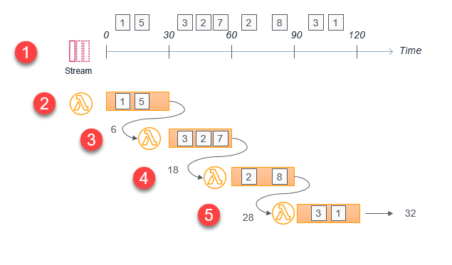
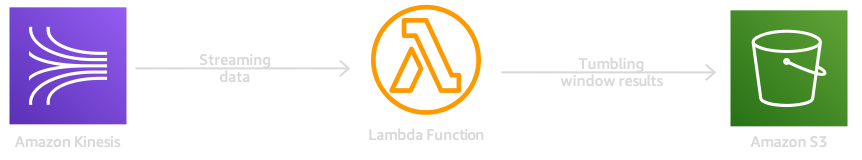

# Streaming Analytics Using Lambda & Tumbling Windows

Mystique Unicorn app process lot of streaming data. The data arrives continuously, often from different sources, and is processed incrementally. Most applications with streaming data, the processing function does not know when the data stream starts or ends. Consequently, this type of data is commonly processed in _batches_ or _windows_.

We will use the concept of a _tumbling window_, which is a fixed-size, non-overlapping time interval duration in the event-source mapping between the stream and the Lambda function. When you apply a _tumbling window_ to a stream, items in the stream are grouped by window and sent to the processing Lambda function. The function **returns** a state value that is passed to the next _tumbling window_.

You can use this to calculate aggregates over multiple windows. For example, you can calculate the total sales value of incoming records of sales from multiple sources in a stream using `30`-second _tumbling window_.



## 🎯 Solutions

We will follow an multi-step process to accomplish our goal. We will create a kinesis data stream to accept streaming data. For the data generator, we will use a _producer_ lambda function that will ingest dummy sales records into the stream. An example is shown below,

```json
{
   "cust_name": "Lizardfolk", 
   "cust_id": 20087128, 
   "sales": 246
}
```

To perform analytics on this streaming data of sales, we will create a _consumer_ lambda function. The kinesis event source mapping is added to the consumer function. After the event source mapping is created, events delivered to the Lambda function have several new attributes. These include:

- **Window start and end**: the beginning and ending timestamps for the current tumbling window.
- **State**: an object containing the state returned from the previous window, which is initially empty. The state object can contain up to 1 MB of data.
- **isFinalInvokeForWindow**: indicates if this is the last invocation for the tumbling window. This only occurs once per window period.
- **isWindowTerminatedEarly**: a window ends early only if the state exceeds the maximum allowed size of 1 MB.

1. The first invocation contains an _empty state object_ in the event. The function returns a state object containing custom attributes that are specific to the custom logic in the aggregation.
1. The second invocation contains the state object provided by the first Lambda invocation. This function returns an updated state object with new aggregated values. Subsequent invocations follow this same sequence.
1. The final invocation in the tumbling window has the _isFinalInvokeForWindow_ flag set to the true. This contains the state returned by the most recent Lambda invocation. This invocation is responsible for storing the result in S3 or in another data store, such as a DynamoDB table. There is no state returned in this final invocation.

In our usecase, The consumer function will aggreate the _total sales_ every `120` seconds and store that in S3 bucket.



In this article, we will build an architecture, similar to the one shown above. We will start backwards so that all the dependencies are satisfied.

1.  ## 🧰 Prerequisites

    This demo, instructions, scripts and cloudformation template is designed to be run in `us-east-1`. With few modifications you can try it out in other regions as well(_Not covered here_).

    - 🛠 AWS CLI Installed & Configured - [Get help here](https://youtu.be/TPyyfmQte0U)
    - 🛠 AWS CDK Installed & Configured - [Get help here](https://www.youtube.com/watch?v=MKwxpszw0Rc)
    - 🛠 Python Packages, _Change the below commands to suit your OS, the following is written for amzn linux 2_
      - Python3 - `yum install -y python3`
      - Python Pip - `yum install -y python-pip`
      - Virtualenv - `pip3 install virtualenv`

1.  ## ⚙️ Setting up the environment

    - Get the application code

      ```bash
      git clone https://github.com/miztiik/tumbling-window-stream-analytics
      cd tumbling-window-stream-analytics
      ```

1.  ## 🚀 Prepare the dev environment to run AWS CDK

    We will use `cdk` to make our deployments easier. Lets go ahead and install the necessary components.

    ```bash
    # You should have npm pre-installed
    # If you DONT have cdk installed
    npm install -g aws-cdk

    # Make sure you in root directory
    python3 -m venv .venv
    source .venv/bin/activate
    pip3 install -r requirements.txt
    ```

    The very first time you deploy an AWS CDK app into an environment _(account/region)_, you’ll need to install a `bootstrap stack`, Otherwise just go ahead and deploy using `cdk deploy`.

    ```bash
    cdk bootstrap
    cdk ls
    # Follow on screen prompts
    ```

    You should see an output of the available stacks,

    ```bash
    tumbling-window-stream-analytics-kinesis-producer-stack
    tumbling-window-stream-analytics-stack
    ```

1.  ## 🚀 Deploying the application

    Let us walk through each of the stacks,

    - **Stack: tumbling-window-stream-analytics-kinesis-producer-stack**

      This stack will create a kinesis data stream and the producer lambda function.

      Initiate the deployment with the following command,

      ```bash
      cdk deploy tumbling-window-stream-analytics-kinesis-producer-stack
      ```

      Check the `Outputs` section of the stack. 

    - **Stack: tumbling-window-stream-analytics-stack**

      This stack will create the consumer stack that will aggregate batch of the sales in each of the records and create a `total_sales` and return it back to lambda service. Every `120` seconds lambda will .

      Initiate the deployment with the following command,

      ```bash
      cdk deploy tumbling-window-stream-analytics-stack
      ```

      Check the `Outputs` section of the stack. You will find the `streamDataProcessor` consumer lambda function and the `DataStore`  S3 bucket where the records will be stored.

1.  ## 🔬 Testing the solution

    Access the produce function and invoke it once. The function results will give you a summary of sales records ingested into kinesis stream. A sample of the summary is shown below,

    ```json
     {
     "statusCode": 200,
     "body": "{\"message\": {\"status\": true, \"record_count\": 156, \"tot_sales\": 42187}}"
     }
    ```

    After about `120` seconds, if you check the `DataStore` S3 bucket, you will be able to find an object key `s3://tumbling-window-stream-ana-streamdatalakea973ccfe-iajxunaczubh/revenue_sum/dt=2021_01_24/1611503884042.json`

    The contents of this file will be `{"sales": 42187}`

1.  ## 📒 Conclusion

    Here we have demonstrated how to use _tumbling windows_ for performing steaming analytics on incoming data.

1.  ## 🧹 CleanUp

    If you want to destroy all the resources created by the stack, Execute the below command to delete the stack, or _you can delete the stack from console as well_

    - Resources created during [Deploying The Application](#-deploying-the-application)
    - Delete CloudWatch Lambda LogGroups
    - _Any other custom resources, you have created for this demo_

    ```bash
    # Delete from cdk
    cdk destroy

    # Follow any on-screen prompts

    # Delete the CF Stack, If you used cloudformation to deploy the stack.
    aws cloudformation delete-stack \
      --stack-name "MiztiikAutomationStack" \
      --region "${AWS_REGION}"
    ```

    This is not an exhaustive list, please carry out other necessary steps as maybe applicable to your needs.

## 📌 Who is using this

This repository aims to show how to perform streaming analtics to new developers, Solution Architects & Ops Engineers in AWS. Based on that knowledge these Udemy [course #1][103], [course #2][102] helps you build complete architecture in AWS.

### 💡 Help/Suggestions or 🐛 Bugs

Thank you for your interest in contributing to our project. Whether it is a bug report, new feature, correction, or additional documentation or solutions, we greatly value feedback and contributions from our community. [Start here](/issues)

### 👋 Buy me a coffee

[](https://ko-fi.com/Q5Q41QDGK) Buy me a [coffee ☕][900].

### 📚 References

1. [Tumbling Windows][1]

1. [Streaming Analytics][1]

1. [Tumbling Window Using an Event Timestamp][3]


### 🏷️ Metadata


**Level**: 300

[1]: https://docs.aws.amazon.com/lambda/latest/dg/with-kinesis.html#services-kinesis-windows
[2]: https://aws.amazon.com/blogs/compute/using-aws-lambda-for-streaming-analytics/
[3]: https://docs.aws.amazon.com/kinesisanalytics/latest/dev/examples-window-tumbling-event.html

[100]: https://www.udemy.com/course/aws-cloud-security/?referralCode=B7F1B6C78B45ADAF77A9
[101]: https://www.udemy.com/course/aws-cloud-security-proactive-way/?referralCode=71DC542AD4481309A441
[102]: https://www.udemy.com/course/aws-cloud-development-kit-from-beginner-to-professional/?referralCode=E15D7FB64E417C547579
[103]: https://www.udemy.com/course/aws-cloudformation-basics?referralCode=93AD3B1530BC871093D6
[899]: https://www.udemy.com/user/n-kumar/
[900]: https://ko-fi.com/miztiik
[901]: https://ko-fi.com/Q5Q41QDGK
